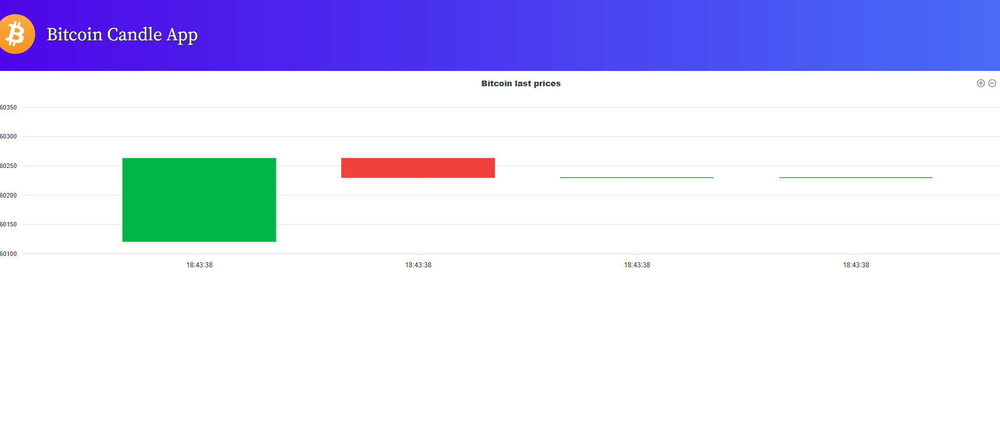

# cotacao-bitcoin-app

# Steps to Start Project:
1 - Create a free account on the https://www.coingecko.com/pt website and generate the API key
2 - In the  generator folder change file name .env-example to .env and insert the api key
3 - Access terminal, enter the api folder and run the command: yarn install and after yarn build and
4 - Still in api folder create the image of the docker with command: docker-compose up, and start the container
4 - Now in the terminal enter the generator folder and run the command: yarn install and after yarn build
5 - Still in generator folder create the image of the docker with command: docker-compose up, and start the container
5 - At the root of the project run the command: pm2 start generator\pm2.json api\pm2.json
6 - In the terminal enter the app folder and run the command: yarn install and after yarn serve

